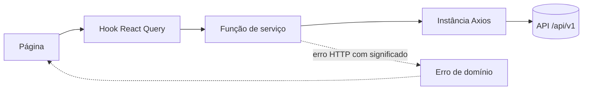
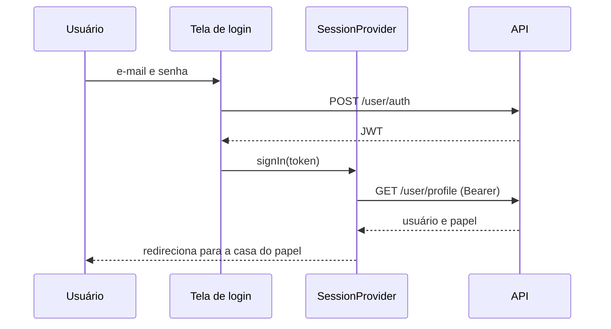
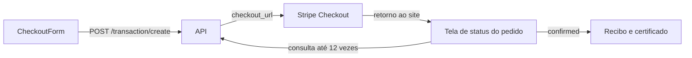

# Frontend da Somos do Bem

Interface web da associação **Somos do Bem** (Indaiatuba, SP), desenvolvida para o FIC 2026. O
site evolui o endereço institucional que a associação já tem (`somosdobem.org.br`) e acrescenta
doação, campanhas, eventos, loja, voluntariado, transparência, verificação de documentos e a área
de trabalho da equipe.

A API consumida por esta interface fica em `../backend`. A visão geral do projeto está no
[README da raiz](../README.md).

## Sumário

1. [O que o site oferece](#o-que-o-site-oferece)
2. [Stack](#stack)
3. [Arquitetura](#arquitetura)
4. [Telas e rotas](#telas-e-rotas)
5. [Fluxos principais](#fluxos-principais)
6. [Acessibilidade e desempenho](#acessibilidade-e-desempenho)
7. [Como executar](#como-executar)
8. [Variáveis de ambiente](#variáveis-de-ambiente)
9. [Scripts](#scripts)
10. [Testes](#testes)
11. [Como inserir fotos, logos e documentos](#como-inserir-fotos-logos-e-documentos)
12. [Convenções de código](#convenções-de-código)

## O que o site oferece

O site tem duas metades que compartilham o mesmo sistema de design, mas não o mesmo layout.

**O site público** é feito para ler e decidir. Qualquer pessoa conhece a associação, acompanha
notícias, apoia uma campanha, compra um convite ou um produto, confere a autenticidade de um recibo
e recupera o próprio certificado de agradecimento. Navegação horizontal, uma ideia por seção.

**A área da equipe** é feita para trabalhar. Depois do login, cada pessoa vê apenas os módulos do
seu papel: o financeiro acompanha transações, reconciliação, recibos e doadores; a comunicação
cuida de campanhas, eventos, produtos, notícias e certificados; a administração enxerga tudo.
Menu horizontal em dois andares, tabelas densas e a tarefa em primeiro lugar.

Dois recursos merecem destaque:

- **Estúdio de certificados.** Um editor em tela inteira, no estilo de um editor de slides, para
  desenhar o certificado de cada campanha ou evento. O que aparece na tela é exatamente o que sai
  no PDF.
- **Modo Leitura Fácil.** Um modo de conteúdo, e não só de tamanho de letra: as páginas trocam o
  próprio texto por uma versão com uma ideia por frase, reduzem o movimento e escondem a decoração.
  Atende diretamente a missão da associação, que trabalha com a inclusão de pessoas com deficiência.

## Stack

| Camada | Ferramenta |
|---|---|
| Biblioteca | React 19 |
| Build | Vite 8 |
| Linguagem | TypeScript 6 (`strict`, `verbatimModuleSyntax`, resolução `bundler`) |
| Roteamento | `react-router-dom` 7 |
| Estado de servidor | `@tanstack/react-query` 5 com `axios` |
| Estilo | TailwindCSS 4 via `@tailwindcss/vite`, com tokens em `src/index.css` |
| Animação | `gsap` 3 com `@gsap/react` |
| 3D | `three`, carregado sob demanda |
| Ícones | `lucide-react`, e `@icons-pack/react-simple-icons` só para marcas de terceiros |
| Lint | `oxlint` |
| Testes | `vitest`, Testing Library e `jsdom` |

**Nenhum componente vem de biblioteca pronta.** Botões, cards, menus, formulários, tabelas e
estados de tela são escritos neste repositório, sem shadcn, Material UI ou Bootstrap. Ícones são a
exceção deliberada, porque são acervo e não componente, e vêm todos do `lucide-react` para o traço
não variar de uma tela para outra.

## Arquitetura

O código é organizado **primeiro por papel e depois por domínio**, a mesma regra do backend, para
que quem transita entre os dois pacotes não precise se readaptar.

### Fluxo de dados

Uma página nunca busca dados diretamente. O caminho é sempre o mesmo, em camadas com uma
responsabilidade cada:



| Camada | Responsabilidade |
|---|---|
| `pages/` | Monta a tela e decide o que mostrar em cada estado (carregando, erro, vazio). |
| `hooks/` | Envolve o React Query: chave de cache, invalidação e paginação. |
| `services/` | Uma função por endpoint, com retorno tipado. Traduz status HTTP relevante em erro de domínio (`NotFoundError`, `CheckoutError`, `UnauthorizedError`). |
| `config/api.ts` | Instância Axios compartilhada: anexa o JWT e limpa a sessão diante de um 401. |
| `types/` | Contratos de resposta da API, um arquivo por domínio do backend. |
| `components/` | Peças reutilizáveis e sem busca de dados: recebem dados e renderizam. |

Princípios que sustentam essa divisão:

- **Estado de servidor pertence ao React Query; estado de interface pertence ao `useState`.** Um
  dado buscado nunca é copiado para o estado local, e nenhum `useEffect` faz requisição.
- **Context só para o que atravessa a aplicação:** sessão, modo de leitura e avisos.
- **Toda tela que lê a API trata três estados explicitamente:** carregando (esqueleto com o formato
  da página), erro (mensagem e nova tentativa) e vazio.
- **A tela decide por tipo, não por texto.** Um 404 numa consulta pública é uma resposta ("código
  inexistente") e a tela decide com `instanceof NotFoundError`, nunca procurando palavras na
  mensagem.

### Sessão e autorização



- O papel **nunca é confiado ao navegador**: o `SessionProvider` reconstrói o usuário a partir de
  `GET /user/profile` a cada carregamento.
- O token fica atrás de `config/session-storage.ts`, o único arquivo que sabe onde ele é guardado.
- Toda rota privada é envolvida por `<RequireRole roles={[...]}>`. Quem está logado sem o papel vê
  "esta tela não é do seu perfil", e não o formulário de login outra vez.
- Esconder uma tela não é segurança: o backend continua sendo a autoridade. O objetivo é que
  ninguém clique num item de menu para descobrir que não podia entrar.

### Estrutura de pastas

```
src/
├── main.tsx              monta <App/> dentro dos provedores
├── App.tsx               árvore de rotas, e nada além dela
├── index.css             entrada do Tailwind, tokens de design (@theme) e camada base
├── config/               env, cliente Axios, query client, armazenamento da sessão, erros de domínio
├── providers/            React Query, sessão e modo de leitura
├── layouts/              layout público e layout da área logada
├── pages/                uma pasta por área (public/, admin/, volunteer/), um arquivo por tela
├── components/
│   ├── ui/               primitivos do design system: botão, card, badge, seção, campos, estados
│   ├── layout/           cabeçalho, rodapé, navegação, banner de página, modo de leitura
│   ├── motion/           revelação, contagem, cenas 3D e o portão de capacidade
│   ├── admin/            casca da área privada: menu, cabeçalho, indicadores, DataList
│   ├── certificate/      prancheta do certificado e o editor em editor/
│   ├── checkout/         o formulário único das três jornadas pagas
│   └── <domínio>/        cards e peças de cada domínio
├── hooks/                hooks de dados (React Query) e de comportamento
├── services/<domínio>/   uma função por endpoint
├── types/                contratos de resposta da API
├── utils/                auxiliares puros (moeda, data, classes, PDF)
└── tests/                testes de jornada
```

Fora de `src/`: `brand/` guarda os arquivos originais do logo enviados pela associação, e
`public/` guarda as versões recortadas que o site realmente carrega (`logo.png`, `logo-branco.png`,
`simbolo.png` e `favicon.png`), além das fotos, das fontes do certificado e dos logos de parceiros.
As versões servidas são geradas a partir de `brand/`, nunca o contrário.

## Telas e rotas

As rotas são em português, em `kebab-case`, espelhando os endereços que o público da associação já
conhece. Nenhuma URL pública expõe id numérico: conteúdo é endereçado por `slug`, documento por
`hash` e doação recorrente por `token`.

### Site público

| Rota | Tela | Origem do dado |
|---|---|---|
| `/` | Home | API e conteúdo |
| `/institucional` `/diretoria` `/conselho` | Institucional | conteúdo |
| `/transparencia` `/impacto` | Transparência e painel de impacto | conteúdo |
| `/recibo/verificar` | Verificação pública de recibo | API |
| `/certificado` `/certificado/:hash` | Segunda via do certificado: ver, baixar e imprimir | API |
| `/eventos` `/eventos/:slug` | Agenda e evento, com convite e Mural do Bem | API |
| `/loja` `/loja/:produto` | Catálogo e produto | API |
| `/doe-agora` | Doação livre ou destinada a uma campanha | API |
| `/campanhas` `/campanhas/:slug` | Campanhas com meta, doação e o mural de quem apoiou | API |
| `/mural-do-bem` | Mural do Bem geral | API |
| `/pedido/:transacaoId/status` | Status do pedido depois do pagamento | API |
| `/noticias` `/noticias/:slug` | Notícias e publicação | API |
| `/assinaturas/gerenciar/:token` | Gestão da doação mensal, sem login | conteúdo |
| `/parceiros` | Rede de parceiros | conteúdo |
| `/voluntariado` `/seja-voluntario` | Programa de voluntariado e cadastro | conteúdo |
| `/perguntas-frequentes` `/fale-conosco` `/ouvidoria` `/trabalhe-conosco` `/politica-de-privacidade` | Apoio | conteúdo |

Onde a coluna diz "conteúdo", o dado é resolvido por um módulo de `src/services/` em vez de uma
rota da API, porque voluntariado, parceiros, painel de impacto e doação recorrente ainda não têm
domínio no backend. O tipo usado já é o que a API vai devolver, então ligar cada um deles é trocar
uma função de serviço, sem mexer na tela.

### Área privada

O acesso é sempre por `/entrar`, e cada pessoa é levada para a casa do seu papel.

| Rota | Tela | Papéis |
|---|---|---|
| `/admin` | Painel geral | admin, finance, communication |
| `/admin/financeiro/transacoes` | Transações com filtro e ações de dinheiro | admin, finance |
| `/admin/financeiro/reconciliacao` | Reconciliação com o gateway | admin, finance |
| `/admin/financeiro/recibos` | Recibos emitidos | admin, finance |
| `/admin/financeiro/doadores` | Doadores | admin, finance |
| `/admin/comunicacao/campanhas` | Campanhas | admin, communication |
| `/admin/comunicacao/eventos` | Eventos | admin, communication |
| `/admin/comunicacao/produtos` | Produtos | admin, communication |
| `/admin/comunicacao/noticias` | Notícias | admin, communication |
| `/admin/comunicacao/certificados` | Estúdio de certificados | admin, communication |
| `/admin/comunicacao/certificados/editor` | Editor em tela inteira | admin, communication |
| `/voluntario/painel` | Painel do voluntário | volunteer, admin |

## Fluxos principais

### Jornadas pagas com um único checkout

Doação, convite de evento e compra na loja são o mesmo `POST /transaction/create` com formatos
diferentes, por isso compartilham o componente `<CheckoutForm>`. O valor só é enviado em doação e
patrocínio: produto e convite são precificados pelo catálogo no backend, o que impede alguém de
comprar uma camiseta por um centavo.



O site **nunca afirma que um pagamento deu certo só porque a pessoa voltou do Stripe**. A tela de
status consulta `GET /transaction/status/:id` e mostra "confirmando" até o backend dizer
`confirmed`. Se as tentativas acabarem, a tela informa que o pagamento ainda está em processamento
e que o e-mail chegará, o que é a verdade, e não um erro. O link do recibo só existe depois da
confirmação.

### Mural do Bem

A caixa "Quero meu nome no Mural do Bem" vem **desmarcada** no checkout. O mural mostra apenas os
nomes que a API devolve, na ordem sorteada por ela, e o hook repete a mesma semente ao carregar
mais nomes, para nenhuma página repetir alguém. Todo nome é o mesmo chip, sem valor, data ou
contagem: nada no mural pode ser lido como "quem deu mais".

### Estúdio e segunda via do certificado

O estúdio guarda uma pasta para o modelo padrão, uma para cada campanha e uma para cada evento,
com o histórico de versões em grade. O editor funciona como um editor de slides: textos, formas,
imagens da biblioteca, a logo e o QR code se movem, giram, mudam de tamanho e de camada, com guias
magnéticas, seleção por laço, alinhar, distribuir, travar, copiar e colar, desfazer, menu do botão
direito, zoom e edição do texto no próprio lugar.

O desenho é feito **uma vez, em pontos de PDF** (`841.89 x 595.28`), pelo componente
`<CertificateArtboard>`, que serve ao editor, às miniaturas e à segunda via pública. A conta de
quebra de linha (`components/certificate/certificate-layout.ts`) é uma cópia exata da do backend,
e a tabela de larguras das fontes é gerada pelo script do backend para os dois pacotes. Por isso o
editor quebra a linha exatamente onde o PDF quebra, e um teste confere isso contra números
calculados pelo backend. Salvar sempre cria a próxima versão; nada é sobrescrito.

Quem perdeu o certificado abre `/certificado`, digita o código impresso nele (ou lê o QR, que já
leva para lá) e vê o certificado na tela, com botões para baixar e imprimir o PDF.

## Acessibilidade e desempenho

A acessibilidade é o critério de desempate da competição, então é requisito de entrega e não
acabamento:

- HTML semântico com landmarks (`header`, `nav`, `main`, `footer`), um `h1` por página e nenhum
  nível de título pulado.
- Foco sempre visível, navegação completa por teclado e link "pular para o conteúdo" como primeiro
  elemento focável.
- Alvos de toque de no mínimo 44px e contraste WCAG AA conferido em cada combinação de cor. As
  cores da marca têm variantes escuras, que são as únicas permitidas como texto sobre branco.
- Formulários com rótulo, dica e erro ligados por construção através do componente `<Field>`, e
  foco levado ao primeiro campo inválido ao enviar.
- Tabelas privadas viram cartões empilhados em telas pequenas, sem rolagem horizontal.

**Animação é melhoria progressiva, nunca dependência.** O hook `use-motion-capability.ts` decide, a
partir de `prefers-reduced-motion`, número de núcleos, memória do aparelho e modo de economia de
dados, se a página anima por completo, anima pouco ou não anima. A página é totalmente legível sem
JavaScript de animação.

- Apenas `transform` e `opacity` são animados; nenhuma propriedade que force novo layout.
- As cenas 3D ficam fora do pacote inicial, são baixadas só por quem pode executá-las, pausam fora
  da tela e se desligam sozinhas abaixo de 30 quadros por segundo. O teto é de três cenas por
  página, porque o recurso caro é o contexto WebGL.
- Só a home e duas páginas curtas entram no pacote de entrada; as demais são rotas `React.lazy`.

## Como executar

### Pré-requisitos

- Node.js 24 ou superior
- A API do backend em execução (veja o [README do backend](../backend/README.md))

### Passo a passo

```bash
npm install
cp .env.example .env     # ajuste a URL se a API não estiver na porta padrão
npm run dev              # http://localhost:5173
```

Para subir a API antes, em outro terminal:

```bash
cd ../backend
docker compose up -d              # MySQL 8.4 no Docker
npx sequelize-cli db:migrate      # cria o schema
npx tsx src/scripts/seed.ts       # carga de demonstração (apaga e recria tudo)
npm run dev                       # http://localhost:3333
```

Para pagar um checkout de teste no navegador, o backend precisa receber os eventos do Stripe:

```bash
stripe listen --forward-to http://localhost:3333/api/v1/transaction/webhook
```

O backend também precisa de `WEB_URL=http://localhost:5173` no `.env` dele: é para esse endereço
que o Stripe devolve o navegador depois do pagamento.

### Acessos da equipe

A carga de demonstração cria um usuário por papel, todos com a senha `Somos@2026`:

| E-mail | Papel | O que alcança |
|---|---|---|
| `admin@somosdobem.org.br` | administração | painel geral, financeiro e comunicação |
| `financeiro@somosdobem.org.br` | financeiro | transações, reconciliação, recibos, doadores e estorno |
| `comunicacao@somosdobem.org.br` | comunicação | campanhas, eventos, produtos, notícias e certificados |
| `voluntario@somosdobem.org.br` | voluntariado | painel próprio com escala, horas e atividades abertas |

O script imprime no fim um hash válido e um cancelado para testar a página de verificação de
recibo. Eles mudam a cada carga.

## Variáveis de ambiente

O Vite expõe ao navegador apenas variáveis com o prefixo `VITE_`. Todas são validadas uma única vez
em `src/config/env.ts`, que interrompe a importação quando um valor é inválido. Nenhum outro arquivo
lê `import.meta.env`.

| Variável | Obrigatória | Padrão | Descrição |
|---|---|---|---|
| `VITE_API_URL` | não | `http://localhost:3333/api/v1` | Base da API, incluindo o prefixo `/api/v1` |

### `.env.example`

```dotenv
# Endereço da API do backend. Precisa incluir o prefixo /api/v1.
# Padrão usado quando a variável não existe: http://localhost:3333/api/v1
VITE_API_URL=http://localhost:3333/api/v1
```

## Scripts

| Comando | O que faz |
|---|---|
| `npm run dev` | Servidor de desenvolvimento com HMR |
| `npm run build` | Checagem de tipos (`tsc -b`) e build de produção |
| `npm run preview` | Serve o build de produção localmente |
| `npm run lint` | Análise estática com `oxlint` |
| `npm test` | Executa os testes uma vez |
| `npm run test:watch` | Testes em modo observador |

## Testes

Os testes ficam em `src/tests/` e são escritos como **jornadas de usuário** com Vitest, Testing
Library e `jsdom`, sempre com ao menos um caminho negativo.

- Elementos são encontrados por papel e nome acessível
  (`getByRole("button", { name: /doar/i })`), nunca por classe ou id de teste. Assim, cada teste
  também prova o requisito de acessibilidade.
- Os módulos de `services/` são substituídos por dublês; o Axios nunca é. Um teste que chegasse à
  API real passaria pelo motivo errado.
- `renderWithProviders` monta a árvore real de provedores, sessão incluída. Um teste da área privada
  entra guardando um token e dublando o perfil, o mesmo caminho que o navegador percorre.
- A suíte roda em metade dos núcleos, com teto de 15 segundos por teste, para que jornadas
  corretas não falhem por disputa de foco entre instâncias do `jsdom`.

Validação completa antes de entregar:

```bash
npm run lint && npm run build && npm test
```

## Como inserir fotos, logos e documentos

Todo lugar do site que espera uma imagem já está reservado na proporção final pelo componente
`<ImageSlot>` e mostra, enquanto o arquivo não existe, a descrição da foto que deve entrar ali.
Assim o layout não se desloca quando a imagem chega.

| Lugar | Caminho | Proporção |
|---|---|---|
| Topo da home | `public/imagens/home-hero.jpg` | 4/3 |
| Sobre nós | `public/imagens/sobre-nos.jpg` | 4/3 |
| Evento | `public/imagens/eventos/`, apontado em `events.image_url` | 16/9 |
| Campanha | `public/imagens/campanhas/`, apontado em `campaigns.image_url` | 16/9 |
| Notícia | `public/imagens/noticias/`, apontado em `posts.image_url` ou no editor de notícias | 16/9 |
| Logo de parceiro | `public/parceiros/<slug>.png` | livre, fundo transparente, altura mínima de 96px |
| Missão (Quem somos) | `public/imagens/institucional-missao.jpg` | 4/3 |
| História (Quem somos) | `public/imagens/institucional-historia.jpg` | 4/3 |
| Retrato de dirigente | `public/imagens/pessoas/<slug>.jpg` | 1/1 |

Para publicar um documento de transparência, salve o PDF em `public/documentos/` e acrescente uma
linha em `src/services/institutional/list-documents-service.ts`. Para publicar a diretoria ou o
conselho, acrescente as pessoas em `src/services/institutional/list-people-service.ts`. Os dois
serviços trazem o formato esperado em comentário.

## Convenções de código

- Arquivos em `kebab-case` com sufixo de papel (`event-card.tsx`, `use-events.ts`,
  `list-events-service.ts`), componentes e tipos em `PascalCase`, hooks começando com `use`.
- As props de um componente são sempre `type <Componente>Props`, declarado logo acima dele.
- Export default só para página e layout; todo o resto é export nomeado.
- Nenhum `any`: resposta da API tem tipo em `types/`, e `unknown` com verificação é a saída.
- Cores sempre por token de função (`bg-primary`), nunca hexadecimal solto no componente.
- Escrita mobile first: as classes base são da tela pequena, e `sm:`, `md:` e `lg:` acrescentam.
- Sem ponto e vírgula, aspas duplas e indentação de 2 espaços, como no backend.
- Commits em inglês, minúsculos, no imperativo e em uma linha, sem Conventional Commits.
